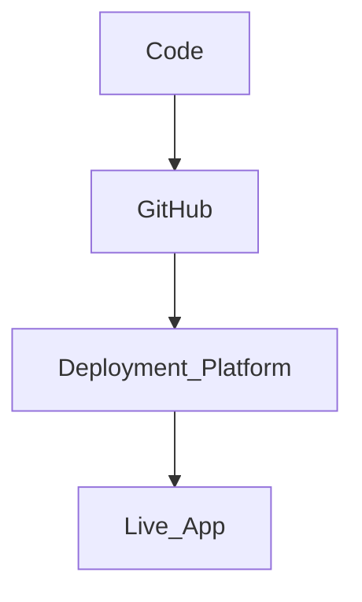

# Deployment Providers Integration Guide

This guide helps you deploy the project using popular platforms. No prior setup assumed.

---

## 🌐 Overview

Supported providers:

* Cloudflare Pages
* GitHub Pages
* Netlify
* Vercel

Each section includes:

* Account setup
* Configuration
* Environment variables
* Testing
* Troubleshooting

---

## 🔁 Deployment Flow



---

# ☁️ Cloudflare Pages

## 1. Account Setup

* Go to https://dash.cloudflare.com
* Create an account and log in

## 2. Create Project

* Go to **Pages → Create Project**
* Connect your GitHub repo

## 3. Build Settings

* Framework preset: None / Vite
* Build command:

  ```bash
  npm run build
  ```
* Output directory:

  ```text
  dist
  ```

## 4. Environment Variables

Add:

```
VITE_API_URL=http://your-backend-url
```

## 5. Deploy

* Click **Deploy**
* Wait for build

## 6. Test

* Open provided URL
* Check UI + API calls

## ⚠️ Troubleshooting

* Build fails → check Node version
* Blank page → wrong build folder
* API issues → wrong env variable

---

# 🐙 GitHub Pages

## 1. Setup

* Go to repo → Settings → Pages
* Select branch: `main` / `gh-pages`

## 2. Build

If using Vite:

```bash
npm run build
```

## 3. Deploy

Use:

```bash
npm install gh-pages --save-dev
```

Add in `package.json`:

```json
"scripts": {
  "deploy": "gh-pages -d dist"
}
```

Run:

```bash
npm run deploy
```

## ⚠️ Troubleshooting

* 404 on refresh → SPA routing issue
* Assets not loading → wrong base path

---

# 🌍 Netlify

## 1. Setup

* Go to https://netlify.com
* Login and connect GitHub

## 2. Create Site

* Click **Add new site → Import from Git**

## 3. Build Settings

* Build command:

  ```bash
  npm run build
  ```
* Publish directory:

  ```text
  dist
  ```

## 4. Environment Variables

Set:

```
VITE_API_URL=http://your-backend-url
```

## 5. Deploy

* Click **Deploy site**

## ⚠️ Troubleshooting

* Build fails → missing dependencies
* Env vars not working → redeploy after adding

---

# ⚡ Vercel

## 1. Setup

* Go to https://vercel.com
* Import GitHub project

## 2. Configure

* Framework: Vite / React
* Auto-detected usually

## 3. Environment Variables

Add:

```
VITE_API_URL=http://your-backend-url
```

## 4. Deploy

* Click **Deploy**

## ⚠️ Troubleshooting

* API errors → wrong backend URL
* Build issues → check logs

---

# ✅ Final Checklist

* App loads correctly
* API calls working
* Environment variables configured
* No console errors

---

# 🎯 Notes

* Do not deploy backend secrets publicly
* Always verify environment variables
* Use HTTPS URLs for production
